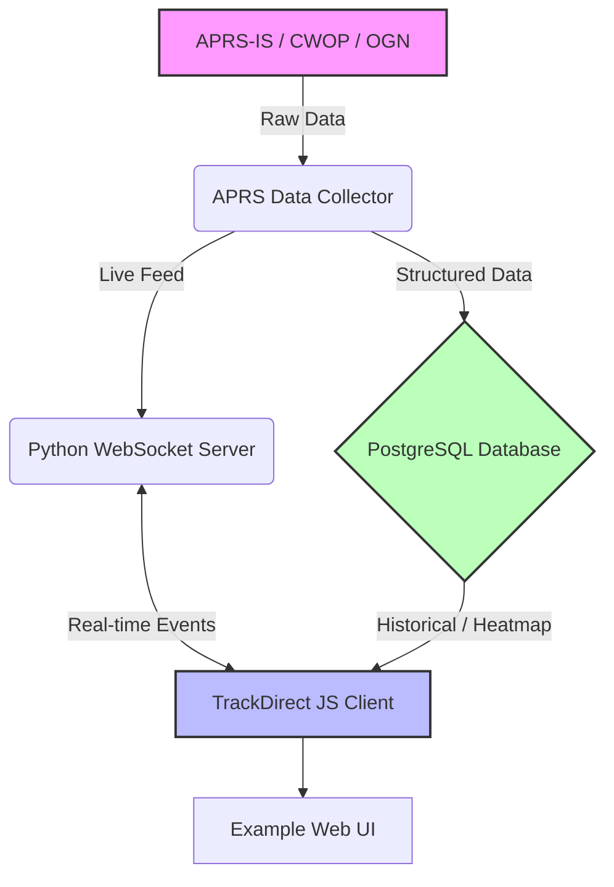

<div align="center">
  <h1>APRS Track Direct</h1>
  <p><strong>A modern, high-performance suite for creating APRS-based real-time tracking websites.</strong></p>

  <!-- Badges -->
  <p>
    <a href="https://github.com/9M2PJU/trackdirect/releases">
      
    </a>
    <a href="https://github.com/9M2PJU/trackdirect/blob/main/LICENSE">
      
    </a>
    
    
  </p>
</div>

---

## 📖 Overview

**APRS Track Direct** is a comprehensive suite of tools designed to facilitate the creation and operation of an APRS-based website. It seamlessly supports data from various networks, including **APRS-IS**, **CWOP-IS**, **OGN**, and other systems adhering to the APRS specification.

### ✨ Key Features
- 📡 **APRS Data Collector**: Robustly gathers tactical data from APRS-compatible sources.
- ⚡ **WebSocket Server**: Facilitates sub-second, real-time communication between the collector and clients.
- 🗺️ **JavaScript Map Library**: A versatile, Vite-bundled library (`jslib`) for client-side operations, featuring interactive web maps (Google Maps/Leaflet).
- 🎨 **Modern Example Website**: A fully functional, glassmorphism-styled template for quick deployment and further customization.

---

## 🏗️ Architecture Setup

The suite is built with performance and modularity in mind.



---

## 🚀 Recent Improvements (v1.1.0)

* 🔮 **UI/UX Modernization**: The default `htdocs` template now features a polished, glassmorphic design system under `main.css`, improved typography, and modernized navigation components with Font Awesome tracking icons.
* 📦 **Vite Bundler**: The Javascript library (`jslib`) compilation process has been thoroughly modernized to use the lightning-fast **Vite** bundler rather than legacy Bash/PHP compilation scripts.
* ⏰ **Day.js Integration**: The deprecated `Moment.js` library has been completely replaced with the lightweight `Day.js`. This dramatically improves initial page rendering and reduces global payload sizes across the board.

---

## 📡 What is APRS?

The **Automatic Packet Reporting System (APRS)** is a digital communication protocol used by amateur radio operators worldwide to share real-time tactical information. 

Typical data broadcasted via APRS includes:
- 📍 GPS coordinates, altitude, speed, and heading.
- ✉️ Messages, alerts, and bulletins.
- 🌤️ Weather reports and telemetry data.

---

## 🛠️ Getting Started

Follow these steps to quickly set up a local development environment or deploy a public APRS website. 

> 💡 **Note:** These instructions serve as general guidelines. Adjustments may be necessary based on your specific requirements. Review the code for deeper insights into its functionality.

### Prerequisites
Ensure you have **Docker** and the **Docker Compose plugin** installed on your system. 
📥 Follow the [official Docker installation guide](https://docs.docker.com/engine/install/).

### Configuration
Edit the following configuration files to suit your deployment environment:
- ⚙️ `config/trackdirect.ini`
- ⚙️ `config/aprsc.conf`
- 🗄️ `config/postgresql.conf`

### Running the Application Structure

Bring the entire application suite online using Docker:

```bash
docker compose up
```

If you want to run the container in daemon mode (background), append `-d` to the command and use `docker compose logs -f` to watch the output on demand. To stop the containers safely, use `docker compose down`.

If everything is set up correctly, open your browser and navigate to `http://127.0.0.1`.

---

## 💻 Development Notes

### Track Direct JavaScript Library (`jslib`)

The **Track Direct JavaScript library** powers all interactive map-related features, including:
- Rendering fast moving markers using **Google Maps API** or **Leaflet**.
- Communicating asynchronously with the backend WebSocket server.
- Supporting DOM interactions and spatial filtering functionalities.

If you make modifications to the core library (located in the `jslib/` directory), rebuild it to apply updates to the `htdocs` frontend using Vite:

```bash
cd jslib
npm install
npm run build
```

### Adapting the Website (`htdocs`)

For setting up a copy on your local machine for development and testing purposes, you do not need to do anything. However, for any public production deployments, it is highly recommended you **adapt the UI**.

The first thing to do is to select which map provider to use. Look for the map provider logic in `index.php`. 
> ⚠️ Note that the map providers used in the demo website may not be suitable if you plan to host a public, high-traffic website. Be sure to read their API usage terms!

### Database Performance Tuning

To enhance database performance, particularly when processing very large continental APRS data streams, consider tweaking the PostgreSQL configuration. You can prioritize speed over maximum data durability.

Recommended high-performance settings inside `config/postgresql.conf`:
```ini
shared_buffers = 2048MB              # Recommended: 25% of total system RAM
synchronous_commit=off               # Avoid blocking disk writes for every commit
commit_delay=100000                  # Will result in a slight 0.1s commit delay but massive batching speed
```

_Note: The database initialized via the included Docker container is already preconfigured with these optimized settings._

---

## 🤝 Contribution
Contributions are absolutely welcome! Create a fork, tackle an issue, and make a pull request. Thank you!

## ⚖️ Disclaimer
These software tools are provided "as is" and "with all its faults". We do not make any commitments or guarantees of any kind regarding security, suitability, errors, or other harmful components of this source code. You are solely responsible for ensuring that data collected and published using these tools complies with all global and local data protection regulations. You are also solely responsible for the protection of your equipment and the backup of your data, and we will not be liable for any damages that you may suffer in connection with the use, modification, or distribution of these software tools.
